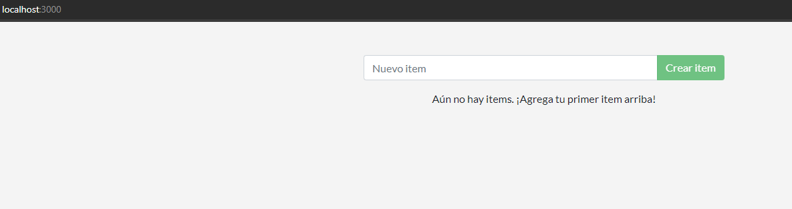
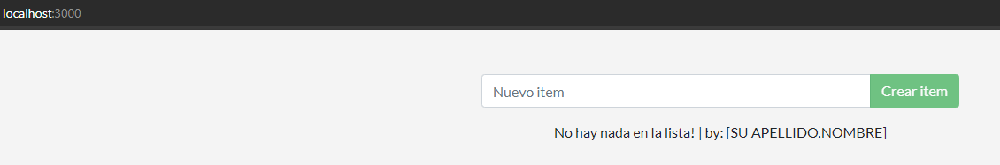

# Parte 1

## Buildear imágen

### Dockerfile Original

```dockerfile
# Usamos la imagen base de Alpine Linux
FROM alpine:latest

# Actualizamos los paquetes e instalamos Node.js y Yarn directamente desde los repositorios oficiales
RUN apk add --no-cache nodejs yarn

# Establecemos el directorio de trabajo
WORKDIR /app

# Copiamos los archivos del proyecto al contenedor
COPY . .

# Instalamos las dependencias del proyecto
RUN yarn install --production

# Exponemos el puerto de la aplicación (ejemplo: 3000)
EXPOSE 3000

# Comando por defecto para ejecutar la aplicación
CMD ["node", "src/index.js"]
```
### Construccion de la imagen

```bash
docker build -f Dockerfile -t entrega:v0.1 .
```

### Verificar tamaño

```bash
docker images

REPOSITORY   TAG       IMAGE ID       CREATED         SIZE
entrega      v0.1      adaa695cddc7   8 minutes ago   161MB
```

### Optimizar y reducir tamaño
Usamos una version de node basada en alpine y reducimos numero de capas juntando las sentencias RUN
```dockerfile
# Usamos una imagen de Node.js basada en Alpine
FROM node:14-alpine

# Establecemos el directorio de trabajo
WORKDIR /app

# Copiamos los archivos del proyecto al contenedor
COPY . .

# Instalamos las dependencias del proyecto y limpiamos la caché de Yarn
RUN yarn install --production && yarn cache clean

# Exponemos el puerto de la aplicación (ejemplo: 3000)
EXPOSE 3000

# Comando por defecto para ejecutar la aplicación
CMD ["node", "src/index.js"]
```

## Correr la aplicación

### Corre el contenedor

```bash
docker run -d -p 3000:3000 --name contenedor_entrega entrega:v0.1

9c15bfe5fc514ccafa65476eedaf0cfd67c4202ca30a23cd53d87c94609ff29d

-d : La app corre en modo detached (En segundo plano)

-p : Especifico el puerto que va a escuchar el contenedor

--name : Especifico el nombre del contenedor

Por ultimo se especifica la imagen
```

### Contenedor corriendo

```bash
docker ps

CONTAINER ID   IMAGE          COMMAND               CREATED         STATUS         PORTS                    NAMES
9c15bfe5fc51   entrega:v0.1   "node src/index.js"   3 minutes ago   Up 2 minutes   0.0.0.0:3000->3000/tcp   contenedor_entrega
```



# Parte 2

## Actualizar código fuente

```bash
docker build -t mi_app:v2 .

docker run -d -p 3000:3000 --name contenedor_entregav2 entrega:v0.2
462a856cd67f760f310ea625a472d04b452b603ed5fc5c53e638c6638b4af51d

docker ps                                                          
CONTAINER ID   IMAGE          COMMAND                  CREATED          STATUS          PORTS                    NAMES
462a856cd67f   entrega:v0.2   "docker-entrypoint.s…"   19 seconds ago   Up 18 seconds   0.0.0.0:3000->3000/tcp   contenedor_entregav2
```


## Eliminar el contenedor e imágen anterior

```bash
docker rm -f contenedor_entrega

docker rmi entrega:v0.1
Untagged: entrega:v0.1
Deleted: sha256:adaa695cddc72f7625c1d578b4579d79fd96ecaef95450c195fcec48c2041142
```

# Parte 3 - Compartir app

```bash
docker image tag entrega:v0.2 gianni29/entrega:v0.2

docker login

docker push gianni29/entrega:v0.2
```

#### Link:
https://hub.docker.com/repository/docker/gianni29/entrega/general

# Parte 4 - Persistencia de datos

```bash
docker run -d -p 3000:3000 --name contenedor_entrega_volumen -v volumen_entrega:/etc/todos entrega:v0.2

docker inspect contenedor_entrega_volumen

"Mounts": [
            {
                "Type": "volume",
                "Name": "volumen_entrega",
                "Source": "/var/lib/docker/volumes/volumen_entrega/_data",
                "Destination": "/etc/todos",
                "Driver": "local",
                "Mode": "z",
                "RW": true,
                "Propagation": ""
            }
        ],
```

Elegí como persistencia de datos un volumen para que el archivo .db esté protegido.


# Parte 5 - Aplicaciones multicontainer

```bash

#Creo la red para los contenedores:
docker network create -d bridge bridge_entrega

#Creo el volumen para MySQL
docker volume create my-sql

#Creo el contenedor de la base de datos con la red, el volumen y los envs
docker run -d --name mysql_db --network bridge_entrega --network-alias db -v mysql_data:/var/lib/mysql -e MYSQL_ROOT_PASSWORD=sec-entrega -e MYSQL_DATABASE=todos mysql:8.0

#Creo el contenedor de la app con los secs y la red
docker run -d --name entrega_sql --network bridge_entrega -p 3000:3000 -e MYSQL_HOST=db -e MYSQL_USER=root -e MYSQL_PASSWORD=sec-entrega -e MYSQL_DB=todos entrega:v0.3

#Verifico que todo haya funcionado
docker logs entrega_sql

Waiting for db:3306.
Connected!
Connected to mysql db at host db
Listening on port 3000
```

# Parte 6 - Utilizando Docker Compose

```bash
docker compose up -d

[+] Running 2/2
 ✔ Container mysql_db     Started                                                                                                                                                                                      0.7s 
 ✔ Container entrega_sql  Started                                                                                                                                                                                      0.4s

docker ps

CONTAINER ID   IMAGE                   COMMAND                  CREATED          STATUS          PORTS                    NAMES
8f6397548f05   gianni29/entrega:v0.3   "docker-entrypoint.s…"   51 seconds ago   Up 49 seconds   0.0.0.0:3000->3000/tcp   entrega_sql
57970ee6654e   mysql:8.0               "docker-entrypoint.s…"   51 seconds ago   Up 49 seconds   3306/tcp, 33060/tcp      mysql_db

docker logs 8f6397548f05

Waiting for db:3306...
Connected!
Connected to mysql db at host db
Listening on port 3000
```